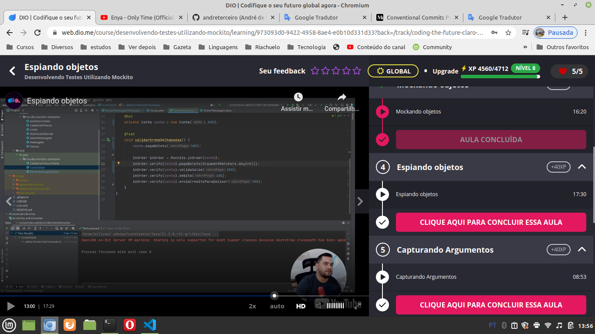
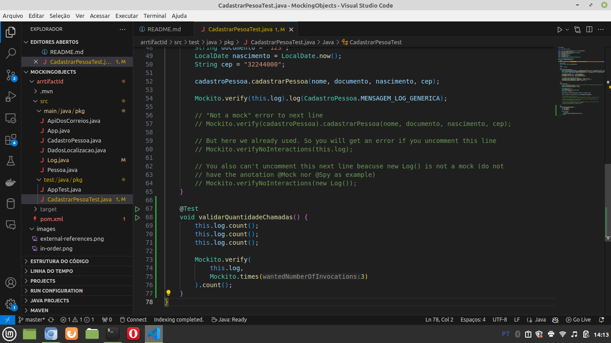
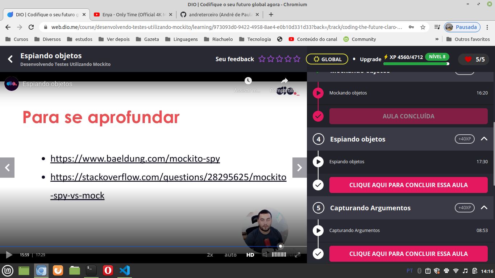
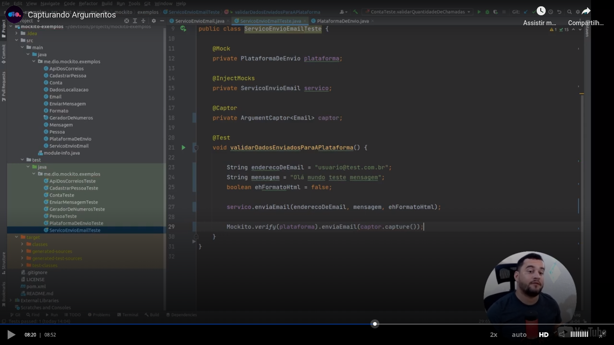
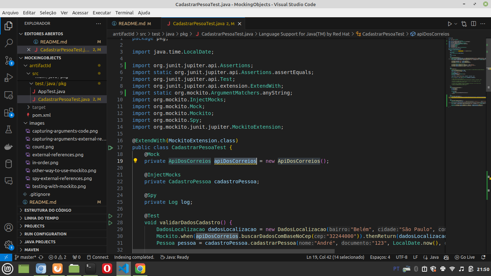
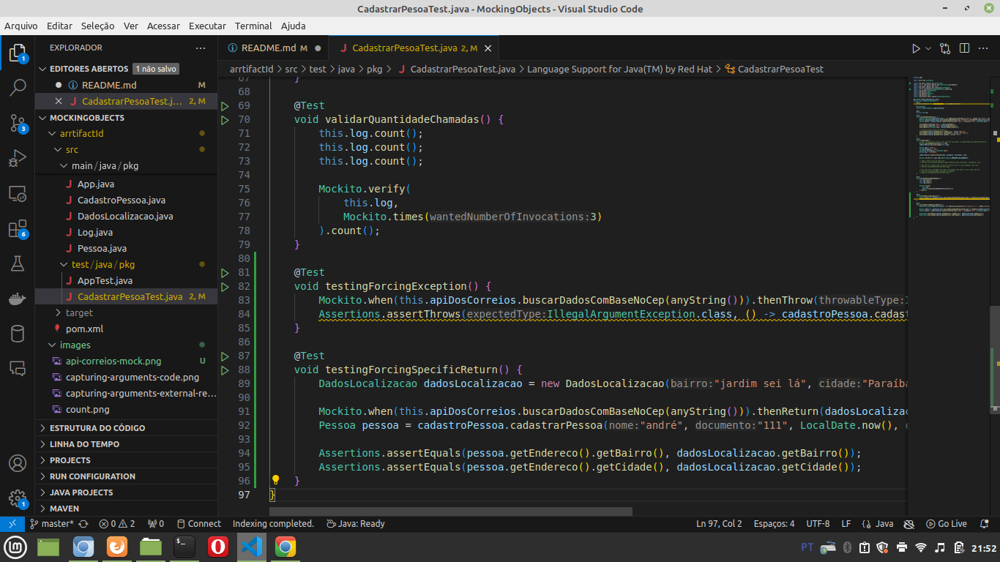
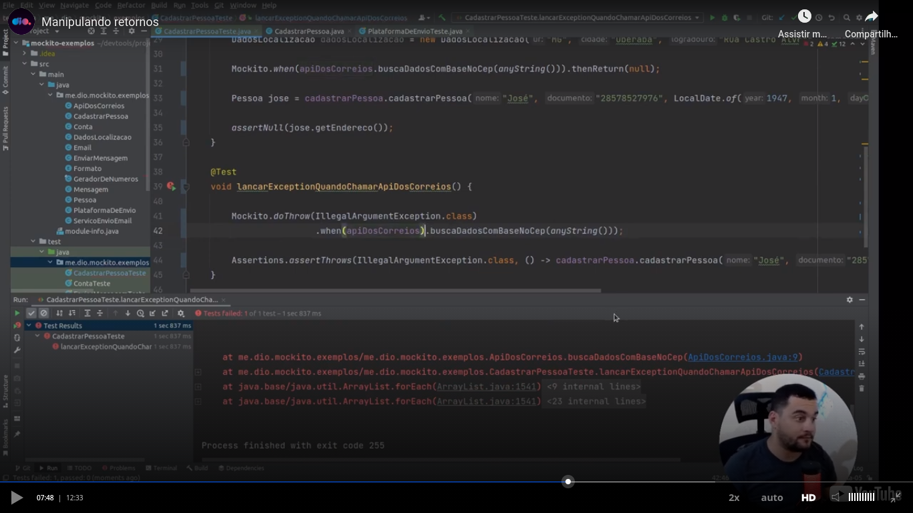

# General

First of all, I created the project:

- With Maven (`~/bin/mvn-ask-parameters`);
- I already solved the problem with Java version (please see [this repository](https://github.com/andreterceiro/dio-java-mockito-initial));
- From [https://mvnrepository.com/repos/central] MVN Reposiory I installed two Mockito dependencies:
  - Mockito Core
  - Mockito JUnit Jupiter

Without annotations, the teacher showed other way to use Mockito:


A test teached in the class:


Teacher passed us in the class this external references:


For now, we made the test of the `spy` this way:

```
package pkg;

import java.time.LocalDate;

import static org.junit.jupiter.api.Assertions.assertEquals;
import org.junit.jupiter.api.Test;
import org.junit.jupiter.api.extension.ExtendWith;
import org.mockito.InjectMocks;
import org.mockito.Mock;
import org.mockito.Mockito;
import org.mockito.Spy;
import org.mockito.junit.jupiter.MockitoExtension;

@ExtendWith(MockitoExtension.class)
public class CadastrarPesoaTest {
    @Mock
    private ApiDosCorreios apiDosCorreios = new ApiDosCorreios();

    @InjectMocks
    private CadastroPessoa cadastroPessoa;

    @Spy
    private Log log;

    @Test
    void validarDadosCadastro() {
        DadosLocalizacao dadosLocalizacao = new DadosLocalizacao("Belém", "São Paulo", "", "rua Álvaro Ramos", "SP");
        Mockito.when(apiDosCorreios.buscarDadosComBaseNoCep("32244000")).thenReturn(dadosLocalizacao);
        Pessoa pessoa = cadastroPessoa.cadastrarPessoa("André", "123", LocalDate.now(), "32244000");

        assertEquals("André", pessoa.getNome());
        assertEquals("123", pessoa.getDocumento());
        assertEquals(LocalDate.now(), pessoa.getNascimento());

        // Testing mocked things with Mockito
        assertEquals(pessoa.getEndereco().getBairro(), "Belém");
        assertEquals(pessoa.getEndereco().getCidade(), "São Paulo");
        assertEquals(pessoa.getEndereco().getUf(), "SP");
    }

    @Test
    void validarLog() {
        // See, at this point we still not used the log object in cadsatroPesssoa.cadastrarPessoa();
        Mockito.verifyNoInteractions(this.log);
        cadastroPessoa.adicionarLogger(this.log);
        cadastroPessoa.cadastrarPessoa("André", "123", LocalDate.now(), "32244000");

        // But here we already used. So you will get an error if you uncomment this line
        // Mockito.verifyNoInteractions(this.log);

        // You also can't uncomment this next line beacuse new Log() is not a mock (do not
        // have the anotation @Mock nor @Spy as example)
        // Mockito.verifyNoInteractions(new Log());
    }
}
```

Please pay see with attention all the things, like the `imports` , the `annotations`, the method call `Mockito.verifyNoInteractions(this.log);` and `the comments`. Please pay attention that we maybe update the source code of this class, but the source code above is the source code that I wanna you understand for a basic `spy`.

You can also inspect the order of the calls:


In the previous image is cool if you verify the details, like the annotation "`@Spy`" and the call to "`ArgumentMatchers.anyInt()`".

In the next image we show how we can verify the number of times a method is called. The use can be more useful, like as example a verification of a method that is called by another method:


External references of the teacher when we are talking about a `spy`:


Related to capture arguments, I did not developed a code because this feature does not seems very interesting to me. But the code teached in the class ("main" code):


The next part, about `forcing a return or a throw` seemed more interesting to me. The scenario is one when I wanna force a return or a throw in a object that is used by an object that I call. In other words:

- I call `cadastroPessoa.cadastrarPessoa()`;
- This method uses `apiCorreios.buscarDadosComBaseNoCep()`;
- I can force the return of `apiCorreios.buscarDadosComBaseNoCep()` or force that an exception be thrown;
- But I never call manually call `apiCorreios.buscarDadosComBaseNoCep()`. This method is called by `cadastroPessoa.cadastrarPessoa()`;
- `cadastroPessoa.cadastrarPessoa()`, that we call, return a `Pessoa`. Then we compare the returned `Pessoa..getEndereco().getBairro()` (example) with the return that we forced to `apiCorreios`;

Requisite: `apiCorreios` needs to be a mock (please see the `@Mock` annotation):


Test:


Here I show a alternative way to test `exceptions`:
